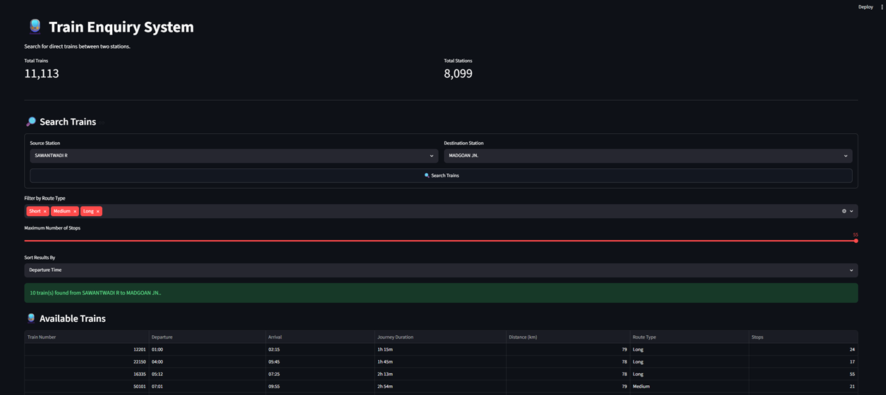

# 🚆 Train Enquiry System

<p align="center">
  
</p>

A **Python and Streamlit based Train Enquiry System** that allows users to search for direct trains between two stations and explore journey details through an interactive web application.

---

## 📌 Project Overview

The Train Enquiry System is built using a cleaned railway train dataset. The project covers the complete workflow from **data cleaning and exploratory data analysis (EDA)** to an interactive **Streamlit application**.

The application allows users to select a source station and destination station, find direct trains, and filter and sort the available train results.

---

## ✨ Features

- 🔎 Search direct trains between two stations
- 🚉 Source and destination station selection
- 🚆 Display available direct trains
- 🕐 Departure and arrival time
- ⏱️ Journey duration calculation
- 📏 Journey distance in kilometers
- 🛤️ Route type classification
- 🛑 Number of stops
- 🎯 Filter trains by route type
- 🎚️ Filter trains by maximum number of stops
- ↕️ Sort results by Departure Time, Journey Duration, or Distance
- ⚠️ Handles routes where no direct trains are available
- 📊 Displays total trains and total stations

---

## 📊 Dataset

The application uses the cleaned dataset:

```text
data/train_cleaned.csv
```

The project analysis contains train-level, route, station, journey-duration, distance, stop, and route-type analysis.

The dataset used in the application contains approximately:

- **11,113 trains**
- **8,099 stations**

---

## 🛠️ Technologies Used

| Technology | Purpose |
|---|---|
| Python | Programming and data processing |
| Pandas | Data cleaning and analysis |
| NumPy | Numerical operations |
| Matplotlib | Data visualization |
| Streamlit | Interactive web application |
| Jupyter Notebook | Exploratory data analysis |

---

## 📁 Project Structure

```text
train_enquiry/
│
├── app/
│   └── train_enquiry.py
│
├── data/
│   └── train_cleaned.csv
│
├── notebooks/
│   └── train_analysis.ipynb
│
├── outputs/
│   ├── charts/
│   └── tables/
│
├── overview_train.png
├── README.md
└── requirements.txt
```

---

## 🔄 Project Workflow

```text
Raw Train Dataset
       ↓
Data Cleaning
       ↓
Exploratory Data Analysis
       ↓
Train-Level Analysis
       ↓
Route & Station Analysis
       ↓
Output Tables & Charts
       ↓
Streamlit Application
       ↓
Train Enquiry System
```

---

## 🔍 Train Search Process

1. User selects a **Source Station**.
2. User selects a **Destination Station**.
3. The system identifies trains available at both stations.
4. Station sequence numbers are compared to ensure the train travels from source to destination.
5. Departure and arrival times are extracted.
6. Journey duration is calculated.
7. Journey distance is calculated.
8. Route type and number of stops are added.
9. Results are displayed in an interactive table.
10. Users can filter and sort the results.

---

## 🎯 Filtering & Sorting

### Route Type Filter

Users can filter trains by:

```text
Short
Medium
Long
```

### Maximum Stops Filter

Users can select the maximum number of stops using a slider.

For example:

```text
Maximum Number of Stops: 10
```

Only trains with **10 or fewer stops** are displayed.

### Sorting

Search results can be sorted by:

```text
Departure Time
Journey Duration
Distance
```

---

## 📓 Data Analysis

The Jupyter Notebook contains the project's exploratory and analytical work:

```text
notebooks/train_analysis.ipynb
```

Analysis includes:

- Train summary
- Average journey duration by route type
- Average distance by route type
- Route distribution
- Top stations
- Longest journeys
- Train stop analysis
- Station and route analysis
- Advanced EDA summary

Generated analytical outputs are stored in:

```text
outputs/charts/
outputs/tables/
```

---

## 🚀 Installation

### 1. Clone the repository

```bash
git clone <YOUR_GITHUB_REPOSITORY_URL>
```

### 2. Open the project folder

```bash
cd train_enquiry
```

### 3. Install dependencies

```bash
pip install -r requirements.txt
```

---

## ▶️ Run the Application

Run the Streamlit application using:

```bash
python -m streamlit run app/train_enquiry.py
```

After running the command, Streamlit will provide a local URL in the terminal.

Open that URL in your browser to use the application.

---

## 📦 Requirements

The project dependencies are listed in:

```text
requirements.txt
```

Current requirements:

```text
pandas
numpy
streamlit
matplotlib
```

---

## 🖥️ Application Flow

```text
Source Station
       +
Destination Station
       ↓
   Search Trains
       ↓
Direct Train Results
       ↓
Filter by Route Type
       ↓
Filter by Maximum Stops
       ↓
Sort Results
       ↓
Available Trains
```

---

## 📈 Project Highlights

- Built a complete train-level analytical workflow using Python and Pandas.
- Performed data cleaning and exploratory data analysis.
- Created analytical output tables and visualizations.
- Developed an interactive Streamlit train enquiry application.
- Implemented direct train matching using station sequence order.
- Added journey duration and distance calculations.
- Added interactive filtering and sorting functionality.
- Included handling for overnight journeys and missing values.

---

## 👨‍💻 Author

**Edwin Aldrin**

BCA Graduate | Data Analytics Enthusiast

### Skills Used in This Project

```text
Python
Pandas
NumPy
Matplotlib
Streamlit
Jupyter Notebook
Data Cleaning
Exploratory Data Analysis
Data Visualization
```

---

## 📄 License

This project is created for **learning, portfolio, and educational purposes**.
